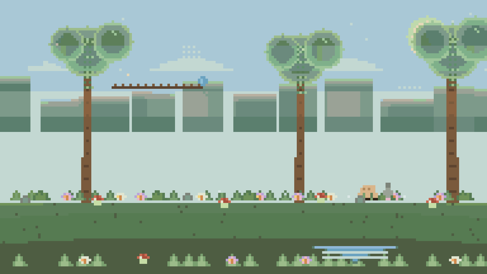

<!-- ================================================================
  Zhishulo 的 GitHub 主页 README · v2（视觉升级版）
  图片均已就位：
    assets/banner.svg                       → 顶部横幅
    assets/avatar.png                       → 头像
    assets/ai-core.svg                      → AI 核心装饰图
    assets/anime-1.jpg / anime-2.jpg        → 二次元图片 ×2
    assets/projects/shisikelang-cover.webp  → Galgame 封面
    assets/projects/bunopet-cover.jpg       → 智能体封面
    assets/projects/bilstm-cover.png        → AI 项目架构图
    assets/forest-dream.gif                 → 森林之梦像素短片（6 秒循环）
  "贪吃蛇"由 Platane/snk 自动生成（跟随 GitHub 贡献图，每 12 小时更新，支持暗黑模式）。
  「💛 心境手记」板块为纯 Markdown + 内联 HTML/CSS 实现，无外部 JS、无新增资源依赖。
================================================================ -->

<!-- ===================== 顶部动态横幅 ===================== -->

  
    
  

 

<!-- ===================== 自我介绍 ===================== -->

  

  <h2>👋 你好，我是 <b>Zhishulo</b></h2>

  

    🎓 一名正在向 <b>AI 研究者</b> 进化的 <b>大学生</b> 
    🤖 沉迷深度学习 / NLP / 智能体 &nbsp;·&nbsp; 🎮 喜欢用代码写故事（Galgame）&nbsp;·&nbsp; 🌸 重度二次元
  

  

    
    
    
    
    
    
  

  

    🛠️ 常用技术栈&nbsp;
    
    
    
    
  

 

  

 

<!-- ===================== 关于我 ===================== -->

  <h2 style="color:#6BCBFF;letter-spacing:3px;">🧑‍🚀 关于我 &nbsp;|&nbsp; About Me</h2>
  

  

    我是一名 <b>在读大学生</b>，正在向 <b>AI 研究者</b> 的方向进化。 
    主攻 <b>深度学习 / NLP / 可解释性</b>，喜欢把模型、数据与工程实现连成完整的故事。 
    用 <b>Galgame</b> 写故事，用 <b>Agent</b> 造伙伴，用 <b>Logit Lens</b> 拆开黑箱。
  

  

    🎓 UNDERGRADUATE
    🧠 FOCUS · XAI / NLP
    🤖 INTEREST · AGENTS
    🎮 GALGAME
    🌸 ANIME
  

  

    Learning：可解释 AI · 情感计算 · 智能体 · 全栈可视化 
    <i>Stay curious. Build things. Make the black box transparent.</i>
  

 

<!-- ===================== 数据面板 ===================== -->

  <h2 style="color:#4facfe;letter-spacing:3px;">⚡ 数据面板 &nbsp;|&nbsp; Live Stats</h2>
  

  
    
  
  
    
  
  
    
  

 

<!-- ===================== 典型项目 ===================== -->

  <h2 style="color:#a855f7;letter-spacing:3px;">🚀 典型项目 &nbsp;|&nbsp; Featured Projects</h2>
  
  
三个不同方向的代表作：讲故事的游戏 · 有温度的智能体 · 打开黑箱的可解释性研究

<table align="center">
  <tr>
    <td align="center" width="33%" style="border:1px solid rgba(168,85,247,.35);border-radius:14px;padding:14px 12px;background:rgba(16,8,36,.35);vertical-align:top;">
      
      <h3><a href="https://github.com/Zhishulo/ShiKeLangSummer">🎮 ShiKeLangSummer</a></h3>
      
我的 <b>第一个 Galgame</b> —— 文字、音乐与选择，讲一个夏天的故事。

      
叙事脚本 · 立绘 · 音乐 · 多结局

      

        
        
         
        
        
      

    </td>
    <td align="center" width="33%" style="border:1px solid rgba(168,85,247,.35);border-radius:14px;padding:14px 12px;background:rgba(16,8,36,.35);vertical-align:top;">
      
      <h3><a href="https://github.com/Zhishulo/BunoPet">🤖 BunoPet</a></h3>
      
一个会 <b>主动关心你</b> 的 AI 伙伴 —— 能理解、能记忆、能回应的桌宠型智能体。

      
Agent · LLM 对话 · 记忆 · 陪伴

      

        
        
         
        
        
        
        
      

    </td>
    <td align="center" width="33%" style="border:1px solid rgba(168,85,247,.35);border-radius:14px;padding:14px 12px;background:rgba(16,8,36,.35);vertical-align:top;">
      
      <h3><a href="https://github.com/Zhishulo/bilstm-logit-lens">🧠 bilstm-logit-lens</a></h3>
      
用 <b>Logit Lens</b> 打开情感分析黑箱 —— 双层 BiLSTM + 因果干预可视化。

      
PyTorch · BiLSTM · Logit Lens · Flask · ECharts

      

        
        
         
        
        
        
        
      

    </td>
  </tr>
</table>

 

<!-- ===================== 学习地图 ===================== -->

  <h2 style="color:#a855f7;letter-spacing:3px;">🧭 学习地图 &nbsp;|&nbsp; Field Guide</h2>
  

  

    
🗂️ Field Guide（点击展开 / 收起）

     
    <table align="center" width="88%">
      <tr>
        <td align="center" width="33%" style="border:1px solid rgba(122,229,130,.35);border-radius:12px;padding:14px 10px;background:rgba(122,229,130,.06);">
          <b style="color:#7ae582;">🟢 地基 · Foundation</b> 
          Python · 数学 · 数据处理
        </td>
        <td align="center" width="33%" style="border:1px solid rgba(79,172,254,.35);border-radius:12px;padding:14px 10px;background:rgba(79,172,254,.07);">
          <b style="color:#4facfe;">🔵 机器学习 · ML</b> 
          回归 · 分类 · 模型评估
        </td>
        <td align="center" width="33%" style="border:1px solid rgba(168,85,247,.35);border-radius:12px;padding:14px 10px;background:rgba(168,85,247,.08);">
          <b style="color:#a855f7;">🟣 深度学习 · DL</b> 
          CNN · BiLSTM · Transformer
        </td>
      </tr>
      <tr>
        <td align="center" style="border:1px solid rgba(157,107,255,.35);border-radius:12px;padding:14px 10px;background:rgba(123,47,247,.08);">
          <b style="color:#b18cff;">💠 可解释性 · XAI</b> 
          Logit Lens · 因果干预
        </td>
        <td align="center" style="border:1px solid rgba(255,47,214,.35);border-radius:12px;padding:14px 10px;background:rgba(255,47,214,.07);">
          <b style="color:#ff2fd6;">🤖 智能体 · Agents</b> 
          对话 · 记忆 · 工具调用
        </td>
        <td align="center" style="border:1px solid rgba(255,159,67,.35);border-radius:12px;padding:14px 10px;background:rgba(255,159,67,.07);">
          <b style="color:#ff9f43;">🎮 创作 · Creation</b> 
          Galgame · 视觉叙事
        </td>
      </tr>
    </table>
  

 

<!-- ===================== 森林之梦 ===================== -->

  <h2 style="color:#9ec59a;letter-spacing:3px;">🌿 森林之梦 &nbsp;|&nbsp; Forest Dream</h2>
  

  
  

    晨雾 · 微风 · 动物 · 阵雨 · 雨后阳光 
    由 <code>scripts/make_forest_dream.py</code> 纯代码逐像素绘制
  

  

    
    
    
  

 

<!-- ===================== 二次元角落 ===================== -->

  <h2 style="color:#ff9f43;letter-spacing:3px;">🌸 二次元角落 &nbsp;|&nbsp; Anime Corner</h2>
  

  
  
    
  
  
<i>热爱可抵岁月漫长 🌙</i>

 

<!-- ===================== 贪吃蛇 ===================== -->

  <h2 style="color:#7ae582;letter-spacing:3px;">🐍 贪吃蛇 &nbsp;|&nbsp; Contribution Snake</h2>
  

  <picture>
    <source media="(prefers-color-scheme: dark)" srcset="https://raw.githubusercontent.com/Zhishulo/Zhishulo/output/github-snake-dark.svg">
    <source media="(prefers-color-scheme: light)" srcset="https://raw.githubusercontent.com/Zhishulo/Zhishulo/output/github-snake.svg">
    
  </picture>
  
我的 GitHub 贡献图化作贪吃蛇，每 12 小时更新 ✨

 

<!-- ===================== 心境手记 ===================== -->

  <h2 style="color:#f6b93b;letter-spacing:3px;">💛 心境手记 &nbsp;|&nbsp; Mental Note</h2>
  
  
一块柔软的小角落 —— 写给同样在阴雨天里跋涉的你，也写给我自己。

<table align="center" width="92%">
  <tr>
    <td style="border:1px solid rgba(255,196,80,.45);border-radius:16px;padding:18px 22px;background:rgba(255,196,80,.08);">
      
<b style="color:#f6b93b;">🌙 开篇自白</b> —— 我是一名<b>中度焦虑 / 抑郁</b>的亲历者。

      
平时，我看起来和大家没什么两样：写代码、做项目、追新番。但情绪低落常常<b>毫无征兆</b>地降临——上一秒还在正常生活，下一秒就被按进水里；躯体化症状发作的时候会更难熬，胸闷、手抖、头晕会一起涌上来，非常非常难受。

      
做这个板块，不是为了卖惨，也不想说教——只是希望有同样经历的你，能<b>少一点孤独感</b>：你不是异类，不是矫情，你的难受真实存在，也值得被认真对待。🫂

    </td>
  </tr>
</table>

 

<table align="center" width="92%">
  <tr>
    <td style="border:1px solid rgba(255,210,120,.35);border-radius:14px;padding:14px 22px;background:rgba(255,210,120,.06);">
      
<b style="color:#f6b93b;">🚫 先澄清几个误区</b>

      
·&nbsp;焦虑 / 抑郁<b>不是「想不开」「玻璃心」「太脆弱」</b>——它是真实的疾病，同时兼具<b>心理感受与生理反应</b>；

      
·&nbsp;它有生理层面的基础，<b>无法只靠意志力直接控制</b>，就像没有人能靠毅力让骨折的腿立刻走路；

      
·&nbsp;所以「振作一点」对它没有用——这不是态度问题，更不是性格缺陷。

    </td>
  </tr>
</table>

 

<table align="center" width="92%">
  <tr>
    <td style="border:1px solid rgba(255,210,120,.35);border-radius:14px;padding:14px 22px;background:rgba(255,210,120,.06);">
      
<b style="color:#f6b93b;">🫀 躯体化：难受的真的不只是「心情」</b>

      
·&nbsp;很多时候，身体会先于情绪「报警」：<b>胸闷、心悸、手抖、头晕、肠胃不适、莫名疲惫、肩背发紧</b>……

      
·&nbsp;这些症状<b>没有明确诱因也可能发作</b>，说发作就发作，发作的时候会非常难受；

      
·&nbsp;请记住：<b>这是疾病正常的临床表现</b>，不是「装出来的」，更不是你的错。

    </td>
  </tr>
</table>

 

<table align="center" width="92%">
  <tr>
    <td style="border:1px solid rgba(255,210,120,.35);border-radius:14px;padding:14px 22px;background:rgba(255,210,120,.06);">
      
<b style="color:#f6b93b;">🌱 温和一些的认知</b>

      
·&nbsp;状态有起伏是恢复过程的常态，<b>不用强迫自己立刻「好起来」</b>；

      
·&nbsp;允许自己慢下来：休息不是堕落，暂停也不等于放弃；

      
·&nbsp;<b>求助不是软弱，而是勇敢</b>——和信任的人聊一聊、预约一次心理咨询，都是很了不起的一步。

    </td>
  </tr>
</table>

 

<table align="center" width="92%">
  <tr>
    <td style="border:1px solid rgba(255,210,120,.35);border-radius:14px;padding:14px 22px;background:rgba(255,210,120,.06);">
      
<b style="color:#f6b93b;">🍵 发作时，不用硬扛 —— 可以试试</b>

      

        ☕ 喝一杯温水
        🫁 做几组缓慢深呼吸
        🚶 暂时离开当下的环境
        🎧 听熟悉的、温柔的声音
        🛋️ 优先让自己舒服下来
      

      
深呼吸可以试试「吸气 4 秒 — 停留 2 秒 — 呼气 6 秒」，先让身体安静下来，其他的事情都可以等一等。

    </td>
  </tr>
</table>

 

<table align="center" width="92%">
  <tr>
    <td style="border:1px solid rgba(255,120,90,.55);border-radius:14px;padding:14px 22px;background:rgba(255,120,90,.08);">
      
<b style="color:#ff8a65;">⚠️ 【重要提示】</b>

      
本板块仅为<b>个人经验分享与科普整理</b>，不构成任何医疗诊断或治疗建议，也不能替代专业帮助。

      
如果症状持续出现、明显影响学习与生活，请及时前往<b>正规医院精神科 / 心理科</b>就诊；紧急或难受时，也可以拨打全国统一心理援助热线 <code>12356</code>。你值得被认真对待。💛

    </td>
  </tr>
</table>

 

<!-- ===================== 页脚 / 联系我 ===================== -->

  

  <h2 style="color:#6BCBFF;letter-spacing:3px;">📫 联系我 &nbsp;|&nbsp; Contact</h2>
  

  <!-- TODO: 可继续补充博客 / B站 / 知乎等 -->
  

    📫 <b>联系我</b> &nbsp;|&nbsp;
    <a href="https://github.com/Zhishulo">GitHub</a> &nbsp;·&nbsp;
    <a href="mailto:zhishulo@sina.com">✉️ zhishulo@sina.com</a>
  

  

    
    
  

  
如果我的项目对你有帮助，欢迎点一个 ⭐ —— 你的鼓励是我更新的动力 💙

  
Made with ❤️ and a lot of ☕ · 愿我们都能被这个世界温柔以待 🌤️

