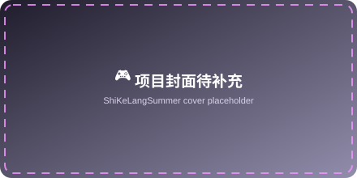
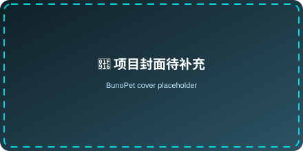
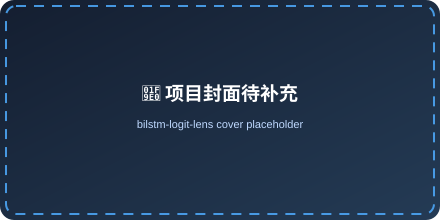
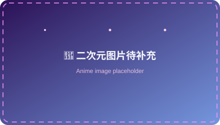
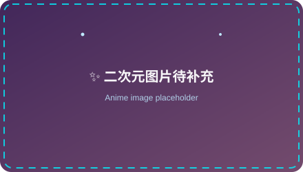

<!-- ================================================================
  Zhishulo 的 GitHub 主页 README
  需要补充的图片（替换同名文件即可，无需改代码）：
    1. assets/avatar-placeholder.svg      → 你的头像
    2. assets/anime-placeholder-1.svg     → 二次元图片 1
    3. assets/anime-placeholder-2.svg     → 二次元图片 2
    4. assets/projects/*.svg              → 三个项目的封面图
  "贡献蛇"动图由 GitHub Action 自动生成（首次推送后手动跑一次
  Actions → Generate Snake → Run workflow，之后每天自动更新）。
================================================================ -->

<!-- ===================== 顶部动态横幅 ===================== -->

  
    
  

 

<!-- ===================== 自我介绍 ===================== -->

  <!-- TODO: 将 assets/avatar-placeholder.svg 替换为你的头像图片 -->
  

  <h2>👋 你好，我是 <b>Zhishulo</b></h2>
  

    🎓 一名正在向 <b>AI 研究者</b> 进化的 <b>大学生</b> 
    🤖 沉迷深度学习 / NLP / 智能体 &nbsp;·&nbsp; 🎮 喜欢用代码写故事（Galgame）&nbsp;·&nbsp; 🌸 重度二次元
  

  

    
    
    
    
    
    
  

 

<!-- ===================== AI 核心动画 ===================== -->

  

 

<!-- ===================== 实时数据面板 ===================== -->

  
  <h2>⚡ 数据面板 &nbsp;|&nbsp; Live Stats</h2>

  
    
  
  
    
  
  
    
  

 

<!-- ===================== 技术栈 ===================== -->

  
  <h2>🛠️ 技术栈 &nbsp;|&nbsp; Tech Stack</h2>

  
    
  
  
  
  
  

 

<!-- ===================== 典型项目 ===================== -->

  
  <h2>🚀 典型项目 &nbsp;|&nbsp; Featured Projects</h2>

<table align="center">
  <tr>
    <td align="center" width="33%">
      <!-- TODO: 替换 assets/projects/shisikelang-cover.svg 为游戏封面 -->
      
      <h3><a href="https://github.com/Zhishulo/ShiKeLangSummer">🎮 ShiKeLangSummer</a></h3>
      
我的 <b>第一个 Galgame</b> —— 用文字、音乐与选择，讲一个属于夏天的故事。

      
      
    </td>
    <td align="center" width="33%">
      <!-- TODO: 替换 assets/projects/bunopet-cover.svg 为智能体封面 -->
      
      <h3><a href="https://github.com/Zhishulo/BunoPet">🤖 BunoPet</a></h3>
      
我的 <b>首个智能体（Agent）</b> —— 一个会陪伴、能对话的 AI 宠物。

      
      
    </td>
    <td align="center" width="33%">
      <!-- TODO: 替换 assets/projects/bilstm-cover.svg 为项目架构图/效果图 -->
      
      <h3><a href="https://github.com/Zhishulo/bilstm-logit-lens">🧠 bilstm-logit-lens</a></h3>
      
我目前 <b>最拿得出手的 AI 项目</b> —— BiLSTM + Logit Lens 可解释性可视化系统。

      
      
      
    </td>
  </tr>
</table>

 

<!-- ===================== 二次元角落 ===================== -->

  
  <h2>🌸 二次元角落 &nbsp;|&nbsp; Anime Corner</h2>

  <!-- TODO: 将 assets/anime-placeholder-*.svg 替换为你喜欢的二次元图片 -->
  
  &nbsp;&nbsp;
  

  

    
  

  
<i>"热爱可抵岁月漫长 🌙"</i>

 

<!-- ===================== 贡献蛇（自动生成） ===================== -->

  
  <h2>🐍 贡献面板 &nbsp;|&nbsp; Contribution</h2>

  <!-- 由 .github/workflows/snake.yml 自动生成到 output 分支 -->
  
  
<i>我的每一格贡献，都会被这条贪吃蛇吃掉 ✨</i>

 

<!-- ===================== 2026 目标 ===================== -->

  
  <h2>🎯 2026 小目标 &nbsp;|&nbsp; Goals</h2>

  <table align="center" width="70%">
    <tr>
      <td align="left" width="45%">🚀 完成一篇可解释性方向的研究</td>
      <td width="55%">
        

          
30%

        

      </td>
    </tr>
    <tr>
      <td align="left">🎮 完成第二部 Galgame 剧本</td>
      <td>
        

          
45%

        

      </td>
    </tr>
    <tr>
      <td align="left">🤖 让 BunoPet 学会"记得我"</td>
      <td>
        

          
60%

        

      </td>
    </tr>
    <tr>
      <td align="left">🌸 补完 N 部新番（N→∞）</td>
      <td>
        

          
99%

        

      </td>
    </tr>
  </table>

 

<!-- ===================== 页脚 ===================== -->

  
    
  

    📫 <b>联系我</b> &nbsp;|&nbsp;
    <a href="https://github.com/Zhishulo">GitHub</a>
    <!-- TODO: 补充你的其他联系方式（邮箱 / 博客 / B站 / 知乎...） -->
  

  

    
  

  
如果我的项目对你有帮助，欢迎点个 ⭐ —— 你的鼓励是我更新的动力 💙

  
Made with ❤️ and a lot of ☕ · 最后更新：2026-08

