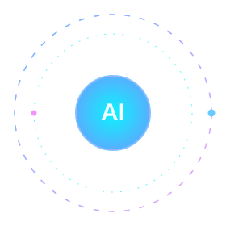
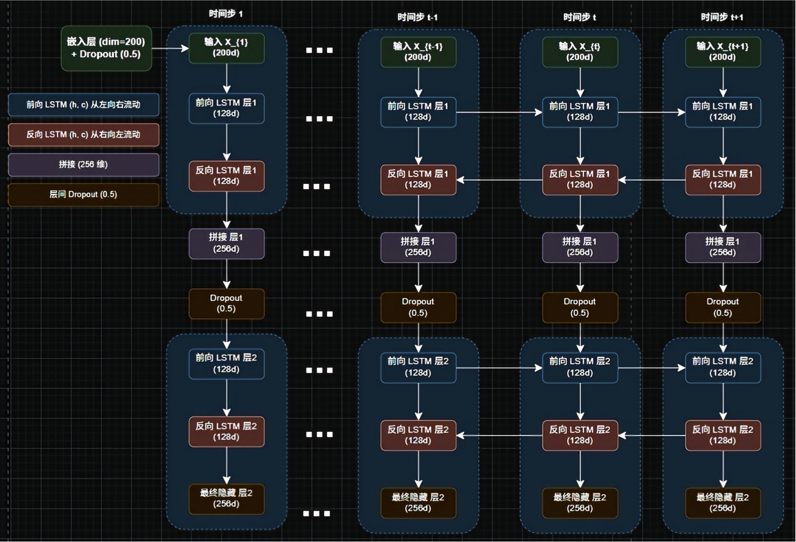
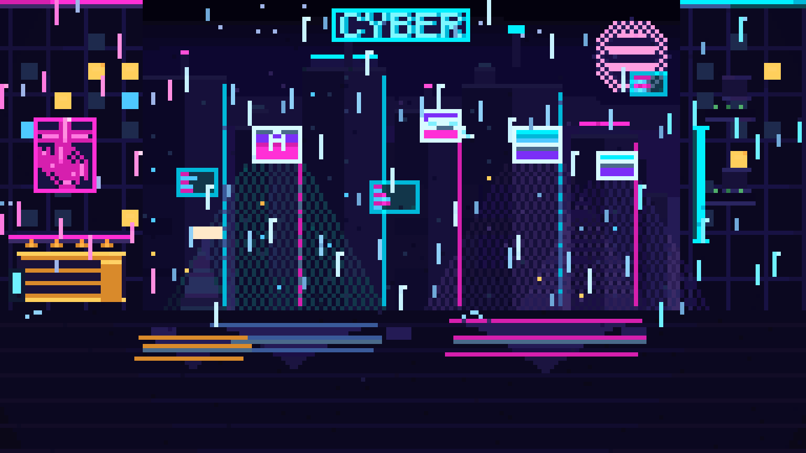
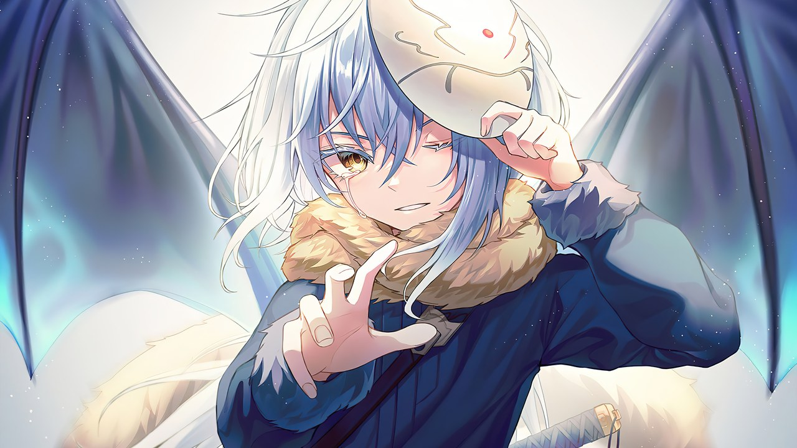
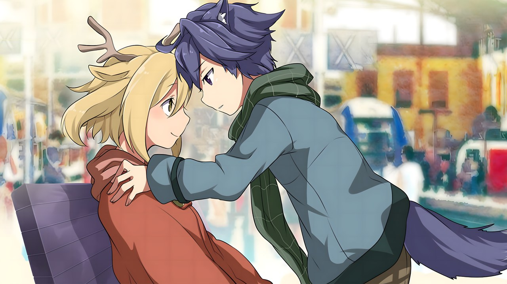

<!-- ================================================================
  Zhishulo 的 GitHub 主页 README
  图片均已就位：
    assets/avatar.png                       → 头像
    assets/anime-1.jpg / anime-2.jpg        → 二次元图片 ×2
    assets/projects/shisikelang-cover.webp  → Galgame 封面
    assets/projects/bunopet-cover.jpg       → 智能体封面
    assets/projects/bilstm-cover.png        → AI 项目架构图
    assets/neon-city.gif                    → 霓虹都市像素动画（4.5 秒循环）
  "签到蛇"由 GitHub Action 每天自动生成（连续打卡天数越多蛇越长）。
================================================================ -->

<!-- ===================== 顶部动态横幅 ===================== -->

  
    
  

 

<!-- ===================== 自我介绍 ===================== -->

  

  <h2>👋 你好，我是 <b>Zhishulo</b></h2>
  

    🎓 一名正在向 <b>AI 研究者</b> 进化的 <b>大学生</b> 
    🤖 沉迷深度学习 / NLP / 智能体 &nbsp;·&nbsp; 🎮 喜欢用代码写故事（Galgame）&nbsp;·&nbsp; 🌸 重度二次元
  

  

    
    
    
    
    
    
  

 

<!-- ===================== AI 核心动画 ===================== -->

  

 

<!-- ===================== 关于我 ===================== -->

  
  <h2 style="color:#00e5ff;text-shadow:0 0 14px rgba(0,240,255,.55);letter-spacing:3px;">🧑‍🚀 关于我 &nbsp;|&nbsp; About Me</h2>
  

    我是一名 <b>在读大学生</b>，正在向 <b>AI 研究者</b> 的方向进化。 
    主攻 <b>深度学习 / NLP / 可解释性</b>，喜欢把模型、数据与工程实现连成完整的故事。 
    用 <b>Galgame</b> 写故事，用 <b>Agent</b> 造伙伴，用 <b>Logit Lens</b> 拆开黑箱。
  

  

    Learning：可解释 AI · 情感计算 · 智能体 · 全栈可视化 
    <i>Stay curious. Build things. Make the black box transparent.</i>
  

  

    🎓 UNDERGRADUATE
    🧠 FOCUS · XAI / NLP
    🤖 INTEREST · AGENTS
    🎮 GALGAME
    🌸 ANIME
  

 

<!-- ===================== 实时数据面板 ===================== -->

  
  <h2 style="color:#00e5ff;text-shadow:0 0 14px rgba(0,240,255,.55);letter-spacing:3px;">⚡ 数据面板 &nbsp;|&nbsp; Live Stats</h2>

  
    
  
  
    
  
  
    
  

 

<!-- ===================== 典型项目 ===================== -->

  
  <h2 style="color:#a855f7;text-shadow:0 0 14px rgba(168,85,247,.6);letter-spacing:3px;">🚀 典型项目 &nbsp;|&nbsp; Featured Projects</h2>

<table align="center">
  <tr>
    <td align="center" width="33%" style="border:1px solid rgba(168,85,247,.35);border-radius:14px;padding:14px 12px;background:rgba(16,8,36,.35);box-shadow:inset 0 0 26px rgba(123,47,247,.08);">
      
      <h3><a href="https://github.com/Zhishulo/ShiKeLangSummer">🎮 ShiKeLangSummer</a></h3>
      
我的 <b>第一个 Galgame</b> —— 文字、音乐与选择，讲一个夏天的故事。

      
叙事脚本 · 立绘 · 音乐 · 多结局

      
      
    </td>
    <td align="center" width="33%" style="border:1px solid rgba(168,85,247,.35);border-radius:14px;padding:14px 12px;background:rgba(16,8,36,.35);box-shadow:inset 0 0 26px rgba(123,47,247,.08);">
      
      <h3><a href="https://github.com/Zhishulo/BunoPet">🤖 BunoPet</a></h3>
      
我的 <b>首个智能体（Agent）</b> —— 会陪伴、能对话的 AI 宠物。

      
Agent · LLM 对话 · 记忆 · 陪伴

      
      
    </td>
    <td align="center" width="33%" style="border:1px solid rgba(168,85,247,.35);border-radius:14px;padding:14px 12px;background:rgba(16,8,36,.35);box-shadow:inset 0 0 26px rgba(123,47,247,.08);">
      
      <h3><a href="https://github.com/Zhishulo/bilstm-logit-lens">🧠 bilstm-logit-lens</a></h3>
      
我目前 <b>最拿得出手的 AI 项目</b> —— BiLSTM + Logit Lens 可解释性系统。

      
PyTorch · BiLSTM · Logit Lens · Flask · ECharts

      
      
    </td>
  </tr>
</table>

 

<!-- ===================== 学习地图 ===================== -->

  

    
🧭 学习地图 · Field Guide（点击展开 / 收起）

     
    <table align="center" width="88%">
      <tr>
        <td align="center" style="border:1px solid rgba(0,240,255,.3);border-radius:12px;padding:12px 8px;background:rgba(16,8,36,.35);">
          <b style="color:#00f0ff;">🟢 地基</b> 
          Python · 数学 · 数据处理
        </td>
        <td align="center" style="border:1px solid rgba(0,240,255,.3);border-radius:12px;padding:12px 8px;background:rgba(16,8,36,.35);">
          <b style="color:#4facfe;">🔵 机器学习</b> 
          回归 · 分类 · 模型评估
        </td>
        <td align="center" style="border:1px solid rgba(168,85,247,.4);border-radius:12px;padding:12px 8px;background:rgba(16,8,36,.35);">
          <b style="color:#a855f7;">🟣 深度学习</b> 
          CNN · BiLSTM · Transformer
        </td>
      </tr>
      <tr>
        <td align="center" style="border:1px solid rgba(168,85,247,.4);border-radius:12px;padding:12px 8px;background:rgba(16,8,36,.35);">
          <b style="color:#7b2ff7;">💠 可解释性</b> 
          Logit Lens · 因果干预
        </td>
        <td align="center" style="border:1px solid rgba(255,47,214,.4);border-radius:12px;padding:12px 8px;background:rgba(16,8,36,.35);">
          <b style="color:#ff2fd6;">🤖 智能体</b> 
          对话 · 记忆 · 工具调用
        </td>
        <td align="center" style="border:1px solid rgba(255,159,67,.45);border-radius:12px;padding:12px 8px;background:rgba(16,8,36,.35);">
          <b style="color:#ff9f43;">🎮 创作</b> 
          Galgame · 视觉叙事
        </td>
      </tr>
    </table>
  

 

<!-- ===================== 霓虹都市 · 像素动画 ===================== -->

  
  <h2 style="color:#00f0ff;text-shadow:0 0 14px rgba(0,240,255,.6);letter-spacing:3px;">🌆 霓虹都市 &nbsp;|&nbsp; Neon City</h2>

  
  

    雨夜 · 霓虹 · 雾中飞车 —— 高精度像素动画，4.5 秒无缝循环 
    由 <code>scripts/make_neon_city.py</code> 纯代码逐像素绘制
  

 

<!-- ===================== 二次元角落 ===================== -->

  
  <h2 style="color:#ff9f43;text-shadow:0 0 14px rgba(255,159,67,.55);letter-spacing:3px;">🌸 二次元角落 &nbsp;|&nbsp; Anime Corner</h2>

  
  &nbsp;&nbsp;
  

  

    
  

  
<i>"热爱可抵岁月漫长 🌙"</i>

 

<!-- ===================== 签到蛇（每天自动更新） ===================== -->

  
  <h2 style="color:#7ae582;text-shadow:0 0 14px rgba(122,229,130,.55);letter-spacing:3px;">🐍 签到蛇 &nbsp;|&nbsp; Daily Check-in</h2>

  <!-- 由 .github/workflows/checkin-snake.yml 每天自动生成到 output 分支 -->
  
  
<i>每天坚持签到，签到蛇就会越来越长 ✨</i>

 

<!-- ===================== 页脚 ===================== -->

  
    
  

    📫 <b>联系我</b> &nbsp;|&nbsp;
    <a href="https://github.com/Zhishulo">GitHub</a> &nbsp;·&nbsp;
    <a href="mailto:zhishulo@sina.com">✉️ zhishulo@sina.com</a>
    <!-- TODO: 可继续补充博客 / B站 / 知乎等 -->
  

  

    
  

  
如果我的项目对你有帮助，欢迎点个 ⭐ —— 你的鼓励是我更新的动力 💙

  
Made with ❤️ and a lot of ☕ · 最后更新：2026-08

